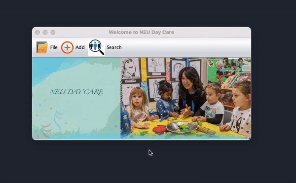

# PreSchool DayCare Application
This Java Swing application was created as a part of CSYE6200 course in Summer 2020.

# Features
- This application will allow users to enter or register students and teachers into the Preschool.
- Users can Search faculties, students and classroom details in this system
- Based on the admitted students, faculty registered, age groups, state laws - this application will allocate class for students and teachers
- It will track student immunization records and alert when renewal is near.
- It will track and alert student annual registration renewal.

# How to Run:
- Clone this repository
- Build and run this application from MainWindow2 main class in Netbeans
- Note: Since it uses Java Swing GUI - need to manually update icons for each page in Netbeans

